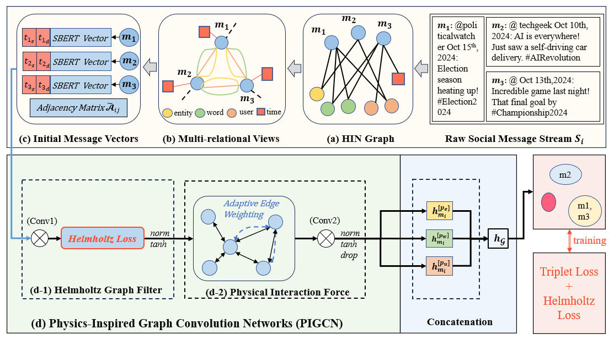
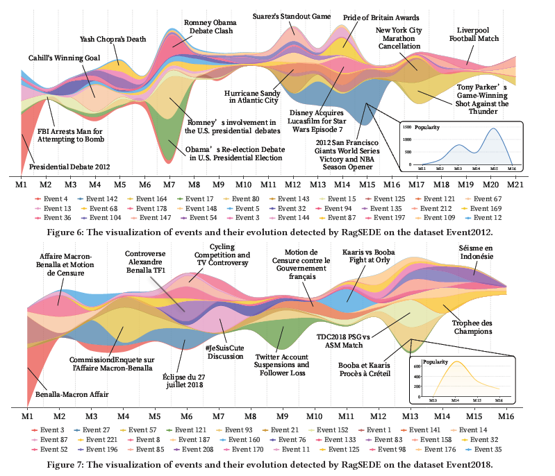

## PIGCN

This repository contains the source code and preprocessed dataset for the **WWW 2026 (acceptance rate: 20.1% (676 out of 3370))**  paper "[PIGCN: Physics-Inspired Graph Convolution Networks for Heterogeneous Social Event Detection](https://ieeexplore.ieee.org/)".

---
## Method Architecture

---
## Run PIGCN

### Install Package Dependencies

    pip install requirements.txt

### Offline Social Event Detection
1) data_processing
- to generate the initial textural features and indices for the messages.  

    cd data_process  
    python S2_generate_initial_features.py      
    python S3_save_edge_index.py
2) run offline detection

    python run_offline_model.py

### Incremental Social Event Detection

---

## Visualization of Wave-based Oscillatory Propagation

For an intuitive illustration of wave-based oscillatory propagation dynamics in social message diffusion, you may find helpful when seeing the final figure in the WWW’26 paper: “Effective and Unsupervised Social Event Detection and Evolution via RAG and Structural Entropy.”

